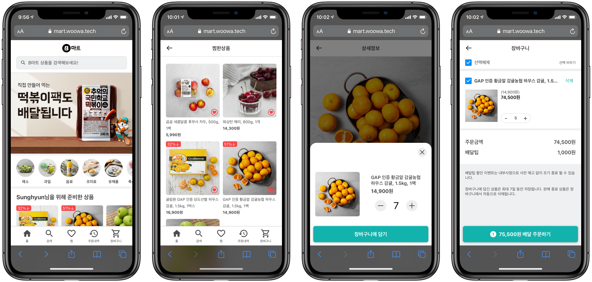
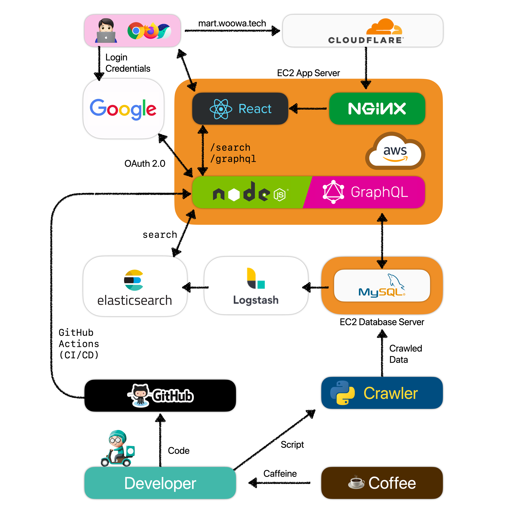

<h1 align="center">bmart ⚡️ 4</h1>
<p align="center">🚚 초소량 번쩍배달 B마트를 소개합니다 💨</b></p>

<p align="center">
  
  <a href="https://github.com/woowa-techcamp-2020/bmart-4/actions">
    
  </a>
   <a href="https://github.com/woowa-techcamp-2020/bmart-4/actions">
    
  </a>
  <a href="https://github.com/woowa-techcamp-2020/bmart-4/releases">
    
  </a>
</p>

[](docs/images/banner.PNG)

## 📱 이런 기술들을 사용했어요

| Area         | Tech Stack                                                                                                                                                                                                                                                                                                                                                                                                                                                                                                                                     |
| ------------ | ---------------------------------------------------------------------------------------------------------------------------------------------------------------------------------------------------------------------------------------------------------------------------------------------------------------------------------------------------------------------------------------------------------------------------------------------------------------------------------------------------------------------------------------------- |
| Frontend     |      |
| Backend      |        |
| Infra        |                                                                                                                                                                                                                                                                                                                         |
| DevOps       |                                                                                                                                                                                                                 |
| Miscellanous |                                                                                                                                                                                                                                                                                                                                                                                                                                           |

## 📱 그 기술들은 이렇게 연결되어 있어요

[](docs/images/abstract.png)

## 🏃‍♂️Getting Started

```bash
$ git clone https://github.com/woowa-techcamp-2020/bmart-4.git
$ cd bmart-4
```

프로젝트를 내려받습니다


```
$ cd client
```

```
// .env.development
REACT_APP_GRAPHQL_URI=[YOUR_GRAPHQL_API_ENDPOINT]
REACT_APP_SEARCH_URI=[YOUR_SEARCH_API_ENDPOINT]
REACT_APP_GOOGLE_OAUTH_URI=[YOUR_GOOGLE_OAUTH_URI]
REACT_APP_AUTO_SUGGEST_URI=[YOUR_AUTO_SUGGEST_API_ENDPOINT]
```

`/client` 디렉토리에 위와 같이 `.env.development` 파일을 생성합니다

```
$ npm i
```

client에 필요한 npm 패키지들을 설치합니다

```
$ cd ../server
$ mkdir public
```

```
// .env
MYSQL_HOST=
MYSQL_ROOT_PASSWORD=
MYSQL_USER=
MYSQL_PASSWORD=
MYSQL_DATABASE=
MYSQL_PORT=
```

`server` 디렉토리에 위와 같이 `.env` 파일을 생성합니다

```
// .env.dev
MODE=
PORT=
MYSQL_HOST=
MYSQL_ROOT_PASSWORD=
MYSQL_USER=
MYSQL_PASSWORD=
MYSQL_DATABASE=
MYSQL_PORT=
ELASTICSEARCH_ENDPOINT=
ELASTICSEARCH_API_KEY_NEW=
GOOGLE_OAUTH_ID=
GOOGLE_OAUTH_SECRET=
GOOGLE_OAUTH_CALLBACK_URL=
JWT_SECRET=
CLIENT_OAUTH_REDIRECT_URI=
```

`server` 디렉토리에 위와 같이 `.env.dev` 파일을 생성합니다

```
$ npm i
```

server에 필요한 npm 패키지들을 설치합니다.

```
$ docker-compose up
```

development 데이터베이스를 실행합니다

```
$ cd ../
$ ./bulid.sh
```

client의 React App을 빌드합니다

```
$ npm run start:dev --prefix server
$ npm run start -- prefix client
```

마지막으로, API node js 서버와 Create React App development 서버를 실행합니다

Happy Hacking!